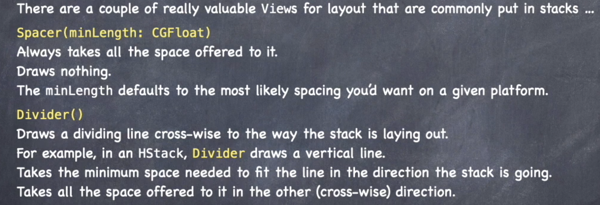

# Notes for Lectures

## Lecture 1:


## Lecture 2:


## Lecture 3:
### MVVM

Swift is serious about separation of **logic & data (MODEL)** from **ui (visual manifestation of the model)**
- SwiftUI takes care of making sure the UI gets rebuilt when model changes

So how would we connect the model to the UI?
1. Model could just be `@State` in a View (minimal separation)
2. Model accessible via a gatekeeper "View Model" class (full separation)
3. View Model class but model is still directly accessible (partial searation)

It depends on the complexity of the model:
- Simple data and little logic --> may opt for #1
- Logic required with lots of data manipulation --> #2 a better choice

> #2 = **M**odel-**V**iew-**V**iew**M**odel architecture -> **MVVM**
>
> This is the primary architecture for any reasonably
> complex SwiftUI application


ViewModel provides the isolation between the Model (Logic & Data) and the View (UI)


ViewModel also process the user's intent - will express that intent in the model and modifies the model:


### Types
#### Struct & Class

- Pretty much the same syntax:
	- Store properties
	- Computed properties
	- Functions (methods)
	- Initialisers (Structs have a default one)

Structs are more commonly used in Swift. So what's the difference?

| struct                                                                                              | class                                                                                                                |
| --------------------------------------------------------------------------------------------------- | -------------------------------------------------------------------------------------------------------------------- |
| Value type                                                                                          | Reference type                                                                                                       |
| Copied when passed or assigned<br><br>no single source of truth                                     | Passed around via pointers<br><br>shared single source of truth                                                      |
| Copy on write<br><br>only copies once changes are made i.e. copy doesn't immediately occur          | Automatically reference counted<br><br>keeps track of no. of pointers - when 0,  automatically cleans out memory     |
| Functional programming<br><br>Immutable data and pure functions - will always be provable i.e. work | Object-oriented programming<br><br>Sticks true to modelling real-world relationships via encapsulation & inheritance |
| No inheritance                                                                                      | Inheritance (single)                                                                                                 |
| "free" init initalises all `var`s                                                                   | "free" init initialises NO `var`s                                                                                    |
| Mutability is explicit (`var` vs `let`)                                                             | Always mutable                                                                                                       |
| Your "go to" data structure                                                                         | Used in specific circumstances                                                                                       |
| Everything seen so far is a `struct` (except `View` which is a protocol)                            | ViewModel in MVVM is always `class` - multiple pointers reference required                                           |

### Generics
**Type Agnostic** - sometimes we just down care about a data type, BUT Swift is a strongly-typed language (vars that are untyped are not used)

**How do we specify a type when we don't care what it is?** = Generics


> **EXAMPLE - Array**
> Arrays use a "don't care type":
> 
> `struct Array<Element>` - when someone uses Array, that's when `Element` get's decided
> 
> Essentially, Array uses a **Type Parameter** (aka a don't care type)

### `protocol`
- A stripped down struct/class
	- has functions and vars, but no implementation or storage

```swift
// EXAMPLE
protocol Moveable {
	func move(by: Int)
	var hasMoved: Bool { get }
	var distanceFromStart: Int { get set }
}
```
- Any type can now claim to implement the `protocol` 
	- `struct PortableThing: Moveable { ... }`
	- --> PortableThing conforms to / behaves like a Moveable
- Protocols can have inheritance
	- e.g. `protocol Vehicle: PortableThing { ... }` then `class Car: Vehicle { ... }`
	- Car must implement the funcs/vars in protocol moveable
- Multiple protocols can be implemented
	- e.g. `class Car: Vehicle, Impoundable, Leasable {...}`
	- Must now implement funcs/vars in Vehicle, Impoundable and Leasable protocols


#### What is it used for?
> N.B. a **PROTOCOL** is a **TYPE** (e.g. a var type or a return type)


Used to specify behaviours for a struct, class or enum
- CONSTRAINS & GAINS
- e.g. a View has to implement var body

Turns "don't cares" into "somewhat cares" using its constrains
- e.g. `struct Array<Element> where Element: Equatable`
- constrains the Element as an Equatable protocol

A way for a type (structs/classes/other protocols) to say what they are capable of + other code can demand certain behaviour out of another type
- neither side has to reveal the implmentation

Functional programming - not about how data structures are formed/stored, focus is on the **functionality** and **hiding the implementation details** behind it


### Functions as Types

A variable can be declared to be of type "function"
- Syntax: (TYPES) -> return value
```swift
(Int, Int) -> Bool    // takes two Ints, returns Bool
(Double) -> Void      // takes a Double, returns nothing
() -> Array<String>   // no argsd, returns Array of Strings
() -> Void            // no args, returns nothing (common)

// functions as types
var operation: (Double) -> Double    // assign operation as type function

// specify a function with the same type-ing
func square(operand: Double) -> Double {
	return operand * operand
}

operation = square    // assign value to operation
operation(4)   // would return 16!
```

Closures - equivalent to inline function types
- i.e. passing a function as an inline type
- used a lot

## Lecture 4
### `enum`
This is another variety of data structure in addition to struct and class
- value type - copy created
- only discrete cases
- data can be associated with each case

```swift
enum FastFoodMenuItem {
	case hamburger(numberOfPatties: Int)  // set associated data for the hamburger case
	case fries(size: FryOrderSize)        // specify another enum as the type
	case drink(String, ounces: Int)       // unnamed string is the brand
	case cookie
	// can have METHODS & COMPUTED PROPERTIES (but not stored)
	func isIncludedInSpecialOrder(number: Int) -> Bool { }
	var calories: Int {
		//switch on self and calculate caloric value here
		switch self {
			case .hamburger(let pattyCount): return pattyCount == number
			case .fries, .cookie: return true
			case .drink(_, let ounces): return ounces == 16
		}
	}
}

enum FryOrderSize {
	case large
	case small
}

// SETTING VALUE OF ENUM
// can infer type on one side of the assignment (but not both)
let menuItem = FastFoodMenuItem.hamburger(patties: 2)
var otherItem: FastFoodMenuItem = .cookie

// CHECKING STATE OF ENUM
// access using let
let menuItem = FastFoodMenuItem.hamburger(patties: 2)
switch menuItem {
	case .hamburger: print("burger")     // swift can infer 
	case .fries: break          // when you dont want to do anything
	// access associated data
	case .drink(let brand, let ounces): print("\(brand) drink of \(ounces)oz") // "a coke drink of 32oz"
	case .cookie: print("cookie")
	default: print("other")     // cover all of the other cases
}

// GET ALL CASES OF ENUM
enum TeslaModel: CaseIterable {
	case X
	case S
	case Three
	case Y
}
// now enum has static var "allCases" for iteration
for model in TeslaModel.allCases {
	reportSaleNumbers(for: model)
}
func reportSalesNumbers(for model: TeslaModel) {
	switch model { ... }
}
```

### Optionals
An Optional is just an enum:
```swift
// Used whenever a value can either be "not set" or "unspecified"
enum Optional<T> {    // T is a generic type - i.e. idontcare
	case none         // NOT SET
	case some(T)      // the some case has associated value of type T - IS SET
}
```

Declaring an optional:
```swift
// Declaring something of type Optional can be done with syntax T?
var hello: String? = "hello"
// equiv.
var hello: Optional<String> = .some("hello")
// OR
var hello = Optional.some("hello")
```

Accessing the associated Optional data:
```swift
// FORCE UNWRAPPING - you assume its not nil, and grab the value
print(hello!)
// equiv
switch hello {
	case .none: // raise an exception (crash)
	case .some(let data): print(data)    // access associated data
}

// SAFE UNWRAPPING - using if let
if let safehello = hello {
	print(safehello)
} else {
	// do something else
}
// equiv.
switch hello {
	case .none: { // do something else }
	case .some(let safehello): print(safehello)
}

// also OPTIONAL DEFAULTING - nil coalescing operator
let x: String? = ...
let y = x ?? "foo"  // set y=x if not nil, if nil y="foo"
// equiv.
switch x {
	case .none: { y = "foo" }
	case .some(let data): y = data
}
```

## Lecture 6
### Layout - how does it work?
e.g. HStack & VStack

1. Container Views are offered some space
2. Views choose what size they want to be - no way to force a size on them
3. Container Views then position the Views inside of them - position is done by containers





What about alignment - specify as an argument to the stack views:
```swift
VStack(alignment: .leading) { ... }   // leading as opposed to left - right to left texts like arabic or hebrew
HStack(alignment: .firstTextBaseling) { ... }     // text baseline alignmnent

// also custom ones but for now we will just cover the built-ins
```


- Grid equivalent to a spreadsheet view


- two-man z stack with difference being the thing that controls the sizing


- GeometryReader itself (it's just a View) - **ALWAYS ACCEPTS ALL THE SPACE OFFERED TO IT**


### @ViewBuilder
way to allow a list of views with conditionals and 'let's
- simple mechanism for supporting more convenient syntax for **lists of Views**
- lots of times we have 'bag of lego views' - ViewBuilder allows us to pass these around
- function still returns something that conforms to View BUT will do so by interpreting the contents as a list of Views and combines them into one
- View that is returned from ViewBuilder can be:
	- `TupleView` - for two or more views
	- `_ConditionalContent` View - when if-else is there
	- `EmptyView` - if there's nothing at all there (weird but possible)
	- Any combination of the above ( if's inside other if's)
- In the end, we dont care what it creates as `some View` sets it up for us

Any func OR read-only computed var can be marked with `@ViewBuilder`:
```swift
//EXAMPLE
@ViewBuilder
func front(of card: Card) -> some View {
	// not legal syntax for a function - just a list of Views
	// if it were a function, it expects a specific return
	let shape = RoundedRectangle(cornerRadius: 20)
	shape.fill(.white)
	shape.stroke()
	Text(card.content)
}
// would return a TupleView<RoundedRectangle,RoundedRectangle,Text>
```

Can also mark a parameter of a function OR an init - argument type must be a "function that returns a view"
- can create our own combiner view (to understand how HStack or LazyVGrid takes it's args)

## Lecture 7
### Shapes
Shape is a **PROTOCOL** - inherits from View
- i.e. shapes are also views
- Draw themselves by filling themselves by default
	- .stroke()
	- .fill() - a generic function

Creating our own Shape
- 

